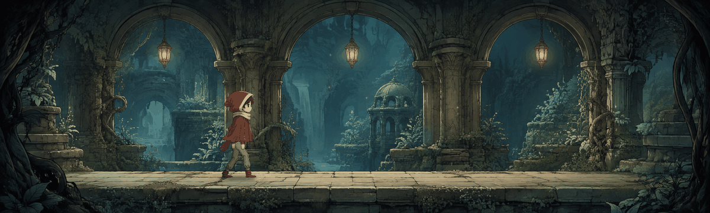

<picture>
  <source media="(prefers-reduced-motion: reduce)" srcset="assets/banner/lantern-passage.png">
  
</picture>

# Hi, I'm Rex.

I build desktop and web tools for everyday tasks and creative workflows. Welcome to my night workshop.

DESKTOP APPS &nbsp; · &nbsp; CREATIVE TOOLS &nbsp; · &nbsp; WEB APPS

## Inside the Workshop

- **Everyday utilities** — Desktop tools that keep plans, tasks, and notes close at hand.
- **Creative workspaces** — Tools for expressive avatars and streaming.
- **Personal finance** — Web interfaces for recording transactions and planning budgets.

<picture></picture>

## Featured Projects

### [NVL Studio](https://github.com/rexkarbu/nvl-studio)

Voice-reactive 2D avatars for OBS streaming.

TypeScript · React · Electron · Vite

### [Dashboard Daily](https://github.com/rexkarbu/dashboard-daily)

Weather, schedules, tasks, and notes in a compact desktop widget.

TypeScript · React · Electron · [Windows release](https://github.com/rexkarbu/dashboard-daily/releases/tag/v0.2.0)

### [ArthaFlow](https://github.com/rexkarbu/arthaflow)

Track income, expenses, and budgets in a personal finance web app.

JavaScript · React · Next.js

## Tools I Use

  
  
  
  
  
  

## Development Focus

- Desktop application workflows.
- Voice-reactive creative tools.
- Personal finance interfaces and data visualization.

<picture></picture>

## GitHub Activity

Account-wide public repositories, including this profile. [Numbers, date, and data sources](assets/activity/README.md).

## Contribution Trail

<picture>
  <source media="(prefers-reduced-motion: reduce)" srcset="assets/activity/contribution-trail-static.svg">
  
</picture>

The calendar visible on GitHub at the last successful update. [Period and static view](assets/activity/README.md#contribution-calendar).

---

*Thanks for stopping by the workshop.*
